# Sistema de Gestão - VendaMais

## Como rodar o projeto

1. Instale as dependências:
`npm install`

2. Inicie o projeto:
`npm run dev`

## Requisitos

- Node.js versão 20.19.1
- Gerenciador de pacotes: npm

> Recomenda-se usar a mesma versão do Node.js para evitar problemas de compatibilidade.

Sistema simples, para controle de vendas de pequenos comerciantes autonomos, com menu de Dashboard, Clientes, Produtos, Vendas, Relatórios e Estoque, podendo ter uma vizualização rápida, cadastrar clientes, produtos, realizar vendas.

### Tela de Login
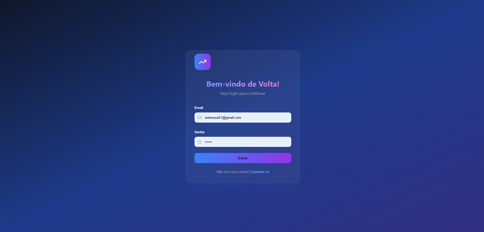

### Tela Dashboard

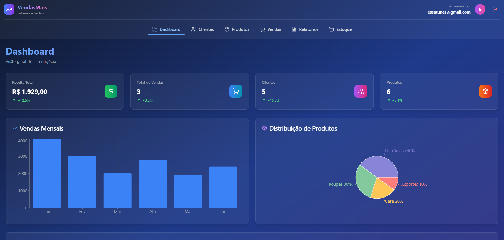

### Tela Clientes e cadastro

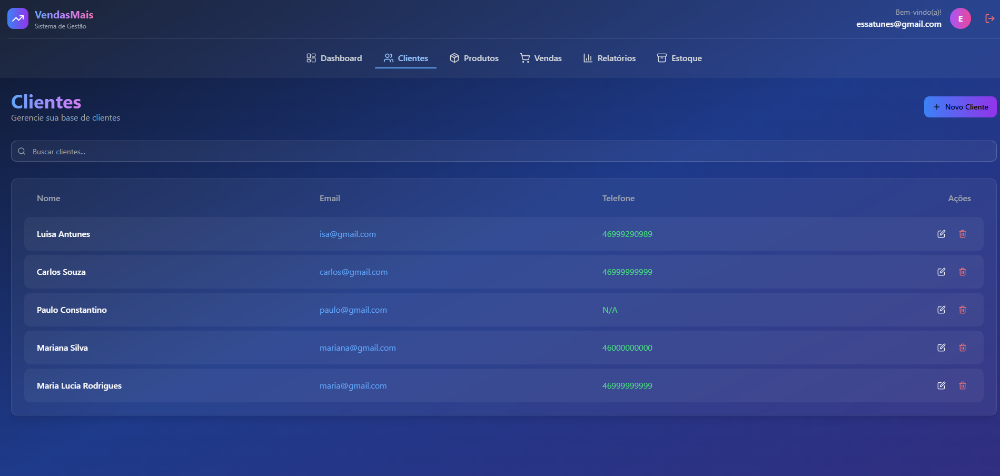
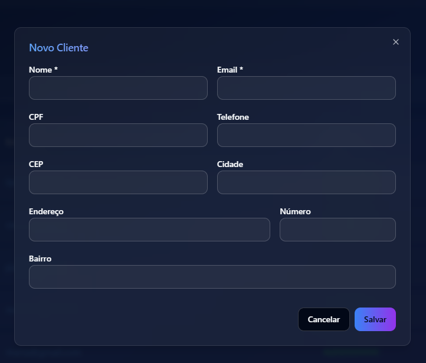

### Tela Produtos e cadastro

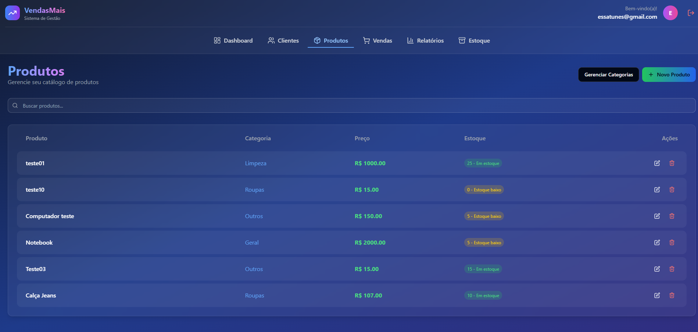
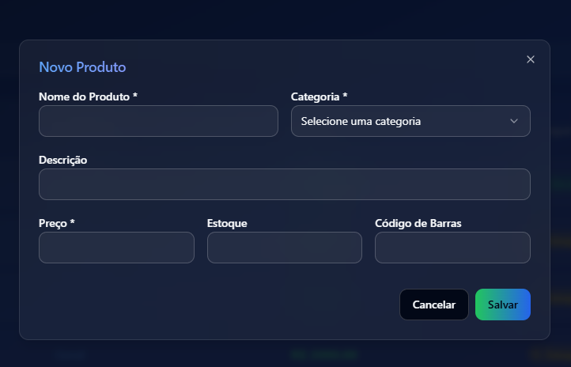
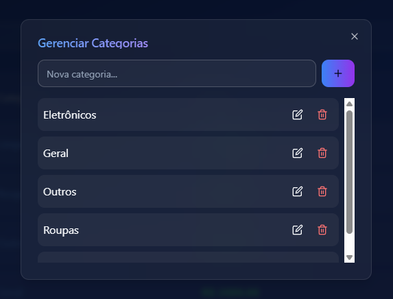

### Tela de Vendas

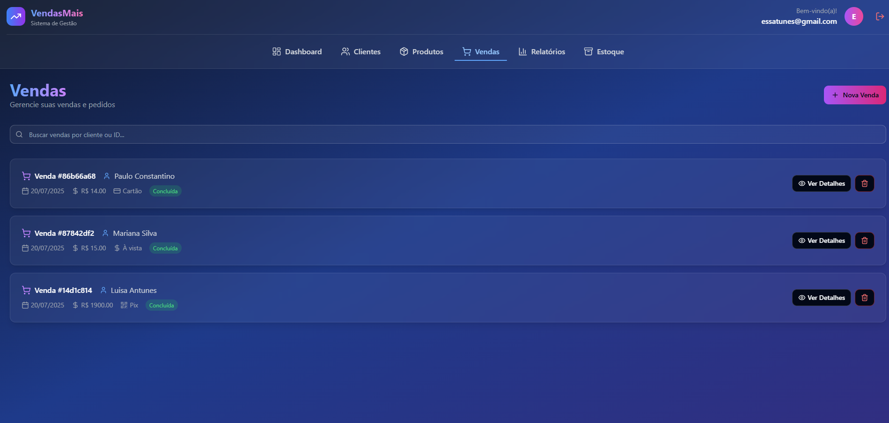
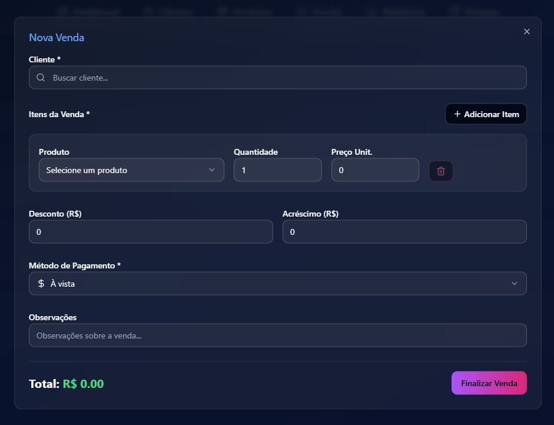

### Tela de Reltórios 

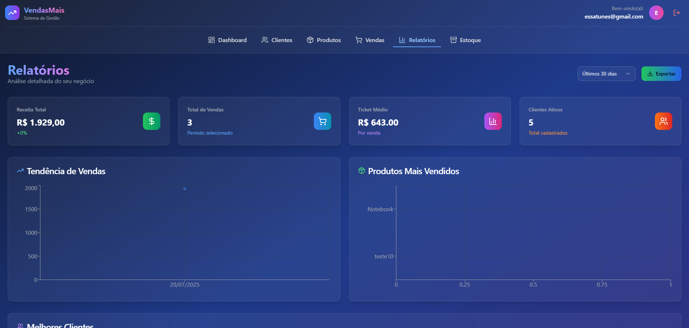

### Tela de Estoque

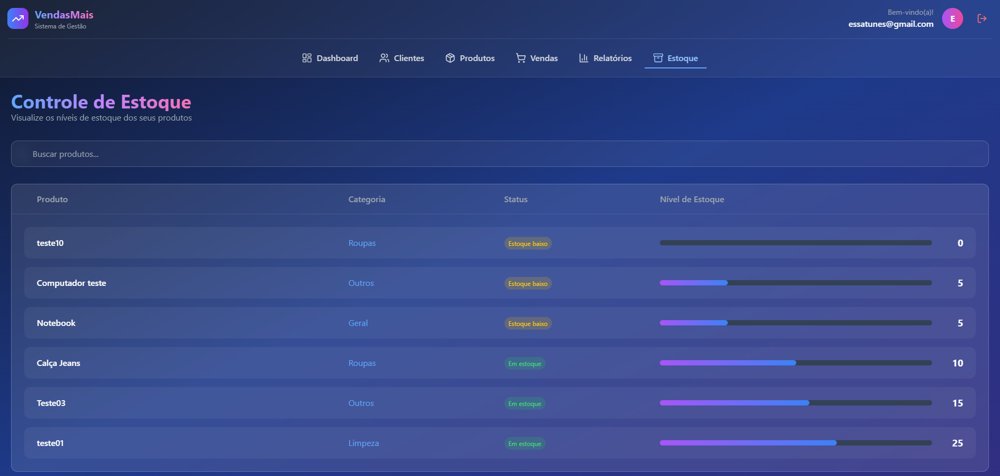

